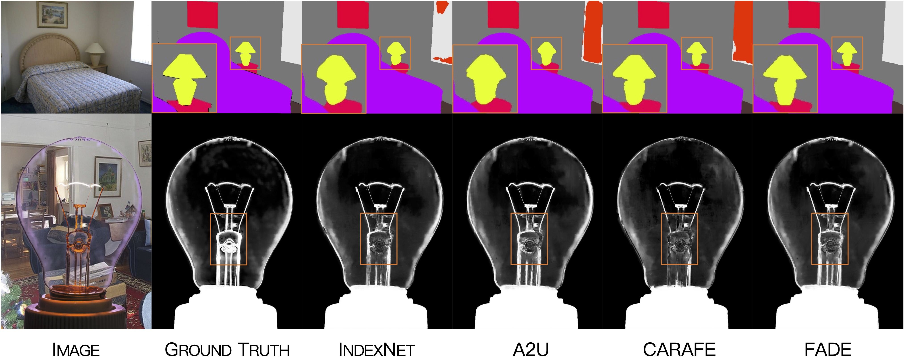

# FADE: Fusing the Assets of Decoder and Encoder for Task-Agnostic Upsampling

<p align="center"></p>
<p align="center">CARAFE&nbsp;&nbsp;&nbsp;&nbsp;&nbsp;&nbsp;&nbsp;&nbsp;&nbsp;&nbsp;&nbsp;&nbsp;&nbsp;&nbsp;&nbsp;&nbsp;&nbsp;&nbsp;&nbsp;&nbsp;&nbsp;&nbsp;&nbsp;&nbsp;&nbsp;&nbsp;&nbsp;&nbsp;&nbsp;&nbsp;&nbsp;&nbsp;&nbsp;&nbsp;&nbsp;&nbsp;&nbsp;&nbsp;&nbsp;&nbsp;&nbsp;&nbsp;&nbsp;&nbsp;&nbsp;&nbsp;&nbsp;&nbsp;&nbsp;&nbsp;&nbsp;&nbsp;&nbsp;&nbsp;&nbsp;&nbsp;&nbsp;&nbsp;&nbsp;&nbsp;&nbsp;&nbsp;&nbsp;&nbsp;&nbsp;&nbsp;&nbsp;&nbsp;&nbsp;&nbsp;&nbsp;&nbsp;&nbsp;&nbsp;&nbsp;FADE</p>

<p align="center"></p>

This repository includes the official implementation of FADE, an upsampling operator, presented in our paper:

**[FADE: Fusing the Assets of Decoder and Encoder for Task-Agnostic Upsampling](https://arxiv.org/abs/)**

Proc. European Conference on Computer Vision (ECCV)

[Hao Lu](https://sites.google.com/site/poppinace/), Wenze Liu, Hongtao Fu, Zhiguo Cao

Huazhong University of Science and Technology, China

## Highlights
- **Simple and effective:** As an upsampling operator, FADE boosts great improvements despite its tiny body;
- **Task-agnostic:** Compared with other upsamplers, FADE performs well on both region-sensitive and detail sensitive dense prediction tasks.
- **Plug and play:** FADE is easily equipped on most of dense prediction models.

## Installation
Our codes are tested on Python 3.8.8 and PyTorch 1.9.0. mmcv(https://github.com/open-mmlab/mmcv) is additionally required for the feature assembly function by CARAFE(https://github.com/myownskyW7/CARAFE).

## Start
Our experiments are based on A2U matting(https://github.com/dongdong93/a2u_matting) and SegFormer(https://github.com/NVlabs/SegFormer). Please follow their installation instruction to prepare the models. In the folders a2u_matting and segformer we provide the modified model and the config files for FADE and FADE-Lite.

## Citation
If you find this work or code useful for your research, please cite:
```
@inproceedings{lu2022fade,
  title={FADE: Fusing the Assets of Decoder and Encoder for Task-Agnostic Upsampling},
  author={Lu, Hao and Liu, Wenze and Fu, Hongtao and Cao, Zhiguo},
  booktitle={Proc. European Conference on Computer Vision (ECCV)},
  year={2022}
}
